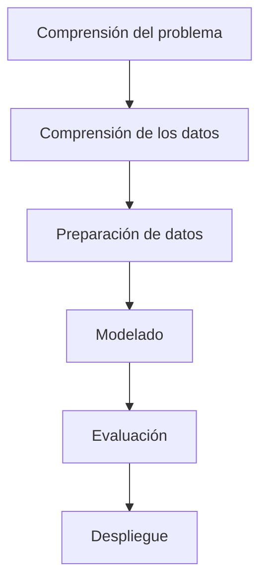

# Análisis de precio de la vivienda de la Ciudad de México: Predicción de Precios y Visualización en Panel Informativo

Dashboard interactivo: [huggingface.co/spaces/Isomorfismo/dashboard-cdmx](https://huggingface.co/spaces/Isomorfismo/dashboard-cdmx)
# 🏠 Predicción del precio de la vivienda en la Ciudad de México

---

## 📌 Resumen

Este proyecto desarrolla un sistema de **Machine Learning para la estimación del precio de viviendas en la Zona Metropolitana de la Ciudad de México**, combinando información inmobiliaria, variables geoespaciales e ingeniería avanzada de características.

El repositorio documenta el flujo completo de Ciencia de Datos:

* 📥 Obtención y consolidación de datos
* 🧹 Limpieza y transformación
* 🗺️ Integración geográfica
* ⚙️ Feature Engineering
* 🤖 Entrenamiento de modelos
* 📊 Evaluación y validación
* 🚀 Exportación para despliegue

El modelo final es consumido por un dashboard interactivo desarrollado con Dash y desplegado públicamente en Hugging Face Spaces.

---

# ⭐ Resultados destacados

<table>
<tr>
<td align="center">
<h3>R²</h3>
<h1>0.8614</h1>
Conjunto de prueba
</td>

<td align="center">
<h3>RMSE</h3>
<h1>$3.01 M</h1>
MXN
</td>

<td align="center">
<h3>MAE</h3>
<h1>$1.66 M</h1>
MXN
</td>

<td align="center">
<h3>Modelo final</h3>
<h1>XGBoost</h1>
Optimizado
</td>
</tr>
</table>

---

# 🎯 El problema

La valuación inmobiliaria es una tarea compleja debido a la interacción de múltiples factores:

* ubicación;
* superficie;
* distribución;
* accesibilidad;
* servicios cercanos;
* características del entorno urbano.

Los modelos tradicionales suelen capturar únicamente relaciones lineales, ignorando patrones espaciales y no lineales presentes en los datos.

Este proyecto explora cómo técnicas modernas de Machine Learning pueden mejorar significativamente la capacidad predictiva utilizando información geográfica y urbana.

---

# 🏙️ Contexto

La Zona Metropolitana de la Ciudad de México constituye uno de los mercados inmobiliarios más grandes y heterogéneos de América Latina.

Propiedades con características físicas similares pueden presentar diferencias sustanciales de precio debido a factores espaciales como:

* proximidad a centros de empleo;
* accesibilidad al transporte;
* concentración de servicios;
* ubicación dentro de colonias de alta demanda.

Por esta razón, la dimensión geográfica se incorpora explícitamente dentro del proceso de modelado.

---

# 🧠 Principales hallazgos

El análisis permitió identificar patrones relevantes:

### 📐 La superficie domina el precio

La variable más importante del modelo corresponde al tamaño del inmueble, representando aproximadamente el 30 % de la importancia total.

### 📍 La ubicación importa tanto como las características físicas

La colonia y las distancias a zonas estratégicas resultaron determinantes para mejorar las predicciones.

### 🚇 La accesibilidad agrega valor

La cercanía a:

* Santa Fe
* Polanco
* Chapultepec
* Roma Norte
* Centro Histórico

aporta información significativa para estimar el valor de mercado.

### 🏘️ Las variables geoespaciales mejoran el desempeño

La incorporación de variables derivadas de coordenadas y puntos de interés permitió incrementar la capacidad predictiva del modelo.

---

# 📈 Evolución del desempeño

## Comparación inicial de modelos

| Modelo           |          RMSE |           MAE |         R² |
| ---------------- | ------------: | ------------: | ---------: |
| Regresión Lineal |     3,718,193 |     2,346,245 |     0.6589 |
| Ridge            |     3,718,231 |     2,346,348 |     0.6589 |
| Random Forest    |     3,123,635 |     1,843,989 |     0.7569 |
| XGBoost          | **3,043,932** | **1,827,011** | **0.7791** |

---

## Modelo final optimizado

| Métrica | Entrenamiento |           Prueba |
| ------- | ------------: | ---------------: |
| R²      |        0.8953 |       **0.8614** |
| RMSE    |  2,510,650.71 | **3,008,983.46** |
| MAE     |  1,430,657.84 | **1,663,383.21** |

---

# 🏆 Mejoras obtenidas

Gracias a la integración geográfica y la ingeniería de características:

✅ Incremento del R² de **0.7791** a **0.8614**

✅ Reducción significativa del error absoluto

✅ Mejor generalización sobre datos no vistos

✅ Incorporación de información espacial dentro del proceso predictivo

✅ Modelo listo para despliegue productivo

---

# 🌐 Dashboard interactivo

El modelo entrenado se encuentra integrado en una aplicación desarrollada con Dash.

### Funcionalidades

* Predicción de precios en tiempo real
* Visualizaciones interactivas
* Exploración geográfica
* Análisis de mercado inmobiliario
* Consulta de variables relevantes

# 🏗️ Arquitectura del proyecto

El proyecto fue desarrollado siguiendo una arquitectura modular, donde cada etapa del proceso de Ciencia de Datos se encuentra desacoplada. Esto facilita la reproducibilidad, el mantenimiento y la incorporación de nuevas fuentes de datos o modelos predictivos.

Esta arquitectura permite separar claramente el procesamiento de datos del despliegue de la aplicación web, haciendo posible actualizar el modelo sin modificar el dashboard.

---

# 🔄 Metodología

Para el desarrollo del proyecto se adoptó la metodología **CRISP-DM (Cross Industry Standard Process for Data Mining)**, ampliamente utilizada en proyectos profesionales de Ciencia de Datos.

Cada etapa se implementó de forma independiente para facilitar la experimentación y garantizar la reproducibilidad del proceso.

---

# 📌 Etapas del proyecto

## 1️⃣ Comprensión del problema

El objetivo consiste en estimar el precio de una vivienda en la Zona Metropolitana de la Ciudad de México utilizando información inmobiliaria y variables derivadas de su contexto geográfico.

La hipótesis principal plantea que la incorporación de variables espaciales mejora significativamente la capacidad predictiva respecto a modelos que consideran únicamente las características físicas del inmueble.

---

## 2️⃣ Comprensión de los datos

Los datos contienen información sobre inmuebles ofertados en la Ciudad de México, incluyendo variables como:

* precio
* superficie
* habitaciones
* baños
* estacionamientos
* colonia
* alcaldía
* coordenadas geográficas

Posteriormente fueron enriquecidos con información espacial proveniente de distintas fuentes.

---

## 3️⃣ Preparación de datos

Esta etapa representa una parte importante del proyecto.

Entre las tareas realizadas destacan:

### Limpieza

* eliminación de registros duplicados;
* tratamiento de valores faltantes;
* estandarización de nombres;
* normalización de texto;
* corrección de formatos numéricos.

### Transformaciones

* codificación de variables categóricas;
* generación de nuevas variables;
* transformación de columnas geográficas;
* eliminación de variables redundantes.

### Validaciones

Se implementaron diversas verificaciones para garantizar la consistencia del conjunto de datos antes del entrenamiento.

---

# 🗺️ Ingeniería geoespacial

Una de las principales contribuciones del proyecto consiste en incorporar información espacial dentro del modelo predictivo.

Para ello se utilizaron herramientas del ecosistema GIS en Python como:

* GeoPandas
* Shapely
* Geopy

A partir de las coordenadas de cada inmueble se calcularon variables relacionadas con la cercanía a distintos puntos de interés.

Entre ellos:

* Santa Fe
* Polanco
* Chapultepec
* Roma Norte
* Centro Histórico

Además, se integró información urbana que permitió enriquecer significativamente el conjunto de datos.

---

# ⚙️ Ingeniería de características

Después de la limpieza se desarrolló un proceso de **Feature Engineering** para incrementar la capacidad predictiva del modelo.

Entre las variables derivadas destacan:

* metros cuadrados por habitación;
* metros cuadrados por baño;
* amenidades agregadas;
* variables geográficas;
* codificaciones categóricas;
* transformaciones de variables numéricas.

La combinación de estas variables permitió capturar relaciones no lineales difíciles de modelar mediante técnicas tradicionales.

---

# 🧰 Stack tecnológico

## Lenguaje

* Python

---

## Procesamiento de datos

* Pandas
* NumPy
* SciPy
* OpenPyXL
* Unidecode

---

## Información geográfica

* GeoPandas
* Shapely
* Geopy

---

## Machine Learning

* Scikit-Learn
* XGBoost
* LightGBM
* Category Encoders

---

## Visualización

* Plotly
* Dash
* Dash Bootstrap Components

---

## Despliegue

* Gunicorn
* Hugging Face Spaces

---
